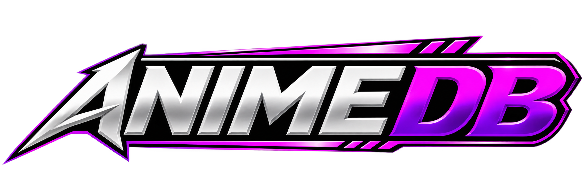
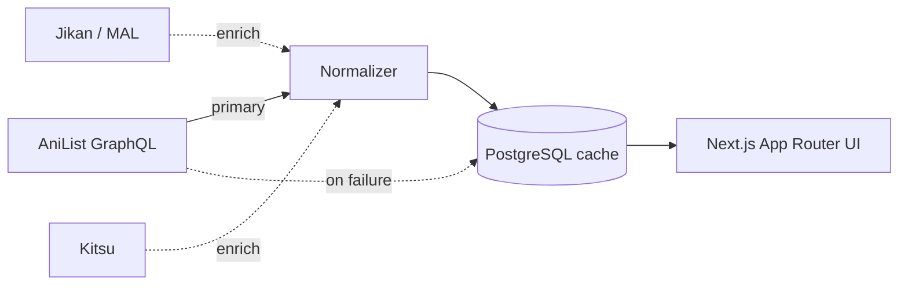

<div align="center">



**An IMDb-style discovery and database platform for anime.**

Built on the Next.js App Router, with AniList as the primary metadata source and Jikan / Kitsu wired in as automatic enrichment fallbacks.

[](https://nextjs.org/)
[](https://www.typescriptlang.org/)
[](https://www.prisma.io/)
[](https://www.postgresql.org/)
[](https://tailwindcss.com/)
[](./LICENSE)

[Features](#features) · [Architecture](#architecture) · [Getting Started](#getting-started) · [Project Structure](#project-structure) · [Roadmap](#roadmap) · [Contributing](#contributing)

</div>

---

## Overview

AnimeDB is a standalone anime database and discovery platform — think IMDb, not Netflix. There's no video streaming here; the focus is rich, reliable metadata: synopses, ratings, cast and staff, episode lists, relations, and personal tracking (favorites, watchlist, ratings).

The UI never talks to a third-party provider directly. Every request flows through a single normalization boundary that merges AniList, Jikan, and Kitsu into one consistent internal shape, then caches the result in PostgreSQL so the app stays fast and resilient even when an upstream API is slow or down.

> This is a standalone project — no shared branding, code, or architecture with any other tool.

---

## Features

- 🔥 **Discovery rails** — Trending, Popular, Top Rated, and current-season Airing, all on the homepage
- 🔍 **Search** — URL-persisted filters (format, status, year, season, genre, sort) with pagination, so results are shareable and bookmarkable
- 📄 **Rich detail pages** — synopsis, studio/format/status info, genre chips, relations, and recommendations
- 🎬 **Episode & credits data** — full episode lists and character/voice-actor/staff credits, auto-enriched from Jikan/Kitsu whenever AniList's data is incomplete
- ❤️ **Personal tracking** — favorite, watchlist (Watching / Plan to Watch / On Hold / Completed / Dropped), and a 1–10 rating widget, all with optimistic UI
- 🗂️ **Browse pages** — dedicated genre, trending, popular, top-rated, airing, upcoming, and seasonal listing pages
- ⚙️ **SEO-ready** — dynamic metadata, `sitemap.ts`, `robots.ts`
- 🧱 **Resilient by design** — cache-first reads, silent enrichment fallbacks, and graceful degradation to last-known-good data on upstream failure
- 🐳 **Container-ready** — `Dockerfile` and `docker-compose.yml` for local or production deployment out of the box

---

## Architecture

The core design principle: **the UI never touches a raw provider response.** Everything flows through one normalization boundary before it reaches a page or component.

```
Provider adapter   →   normalizer   →   internal model   →   UI
lib/api/providers/*    normalize.ts    lib/api/types.ts    app/, components/
```

`lib/api/metadata-service.ts` is the single orchestrator for all of this. For an anime detail page, it:

1. **Fetches** from AniList (GraphQL) and normalizes the response into an `AnimeDetail`.
2. **Caches** the result to PostgreSQL (`prisma.anime.upsert`) — the database is a growing cache, not a full mirror of any provider.
3. **Enriches**, best-effort and fail-silent: if AniList is missing an episode list or cast, it calls Jikan by MAL ID; if synopsis or age-rating is still missing, it calls Kitsu. A slow or unavailable third-party source never breaks the page.
4. **Falls back** to the last cached row if the live AniList request fails, instead of erroring out.



---

## Tech Stack

| Layer         | Choice                                                             |
| ------------- | ------------------------------------------------------------------- |
| Framework     | Next.js 14 (App Router) + TypeScript                                |
| Styling       | Tailwind CSS — design tokens in `app/globals.css`                   |
| Database      | PostgreSQL + Prisma ORM                                             |
| Primary API   | [AniList](https://anilist.co) GraphQL (no key required for reads)   |
| Enrichment    | [Jikan](https://jikan.moe) (MyAnimeList), [Kitsu](https://kitsu.io) |
| Validation    | [Zod](https://zod.dev)                                              |
| Icons         | [Lucide](https://lucide.dev)                                        |
| Deployment    | Docker / Vercel + any managed PostgreSQL (e.g. Neon, Supabase)      |

---

## Getting Started

### Prerequisites

- **Node.js** 20+
- **PostgreSQL** 16+ (local, Docker, or a managed provider like [Neon](https://neon.tech) / [Supabase](https://supabase.com))

### 1. Clone and install

```bash
git clone https://github.com/<your-username>/animedb.git
cd animedb
npm install
```

### 2. Configure environment variables

```bash
cp .env.example .env
```

| Variable                | Required | Description                                                          |
| ------------------------ | :------: | ---------------------------------------------------------------------- |
| `DATABASE_URL`           |    ✅    | PostgreSQL connection string                                         |
| `NEXT_PUBLIC_SITE_URL`   |    ✅    | Public site URL — used for canonical links, sitemap, and Open Graph  |
| `AUTH_SECRET`            |    ⬜    | Reserved for auth (Phase 6, not yet implemented)                     |
| `JIKAN_BASE_URL`         |    ⬜    | Override the default Jikan endpoint                                  |
| `KITSU_BASE_URL`         |    ⬜    | Override the default Kitsu endpoint                                  |
| `SIMKL_CLIENT_ID`        |    ⬜    | Reserved for a future SIMKL provider (Phase 7)                       |

No API key is required to get started — AniList, Jikan, and Kitsu are all keyless for reads.

### 3. Start a database

The fastest way to get PostgreSQL running locally is Docker:

```bash
docker compose up -d db
```

This starts Postgres on `localhost:5432` with credentials that already match `.env.example`.

### 4. Push the schema

```bash
npx prisma db push
```

### 5. Run the dev server

```bash
npm run dev
```

Visit [http://localhost:3000](http://localhost:3000).

### Running with Docker (full stack)

```bash
docker compose up -d
```

This builds and runs both the `web` app and the `db` service together.

---

## Available Scripts

| Command              | Description                              |
| --------------------- | ----------------------------------------- |
| `npm run dev`         | Start the development server              |
| `npm run build`       | Generate the Prisma client and build      |
| `npm run start`       | Start the production server               |
| `npm run lint`        | Run ESLint                                |
| `npm run typecheck`   | Run TypeScript in `--noEmit` mode         |
| `npm run db:push`     | Push the Prisma schema to the database    |
| `npm run db:migrate`  | Create and apply a Prisma migration       |
| `npm run db:studio`   | Open Prisma Studio                        |

---

## Project Structure

```
app/            Routes (App Router) — pages, layouts, metadata, sitemap
components/     Reusable UI (ui/, layout/, anime/, search/)
lib/api/        Provider adapters + normalizers + metadata service (cache-first)
  providers/anilist/   Primary source — GraphQL client, queries, normalizer
  providers/jikan/     Enrichment — episodes, cast fallback
  providers/kitsu/     Enrichment — synopsis/age-rating fallback
lib/auth/       Guest/session identity (temporary, pre-auth)
lib/actions/    Server Actions (favorite, watchlist, rating mutations)
lib/db/         Prisma client singleton
lib/utils/      Small shared helpers (slugify, etc.)
prisma/         schema.prisma — full data model
```

---

## Deployment

AnimeDB ships with everything needed for either path:

- **Docker** — `Dockerfile` + `docker-compose.yml` are ready for any VPS or container host.
- **Vercel** — `output: "standalone"` and a Prisma-aware build script (`prisma generate && next build`) mean it deploys cleanly to Vercel; pair it with a managed Postgres provider such as [Neon](https://neon.tech) or [Supabase](https://supabase.com) for `DATABASE_URL`.

In either case, remember to run `npx prisma db push` (or `db:migrate` for a versioned migration) against the target database before first launch.

---

## Roadmap

- [ ] **Phase 6** — Real authentication (replacing the temporary cookie-based guest identity)
- [ ] **Phase 7** — Additional metadata providers (SIMKL, TVDB)
- [ ] Public GraphQL API for third-party developers

---

## Contributing

Issues and pull requests are welcome. Before opening a PR:

```bash
npm run lint
npm run typecheck
```

Please keep changes scoped and describe the reasoning in the PR description — especially for anything touching `lib/api/metadata-service.ts`, since it's the single source of truth for how providers are merged and cached.

---

## Data Sources & Attribution

Metadata is sourced from and enriched by:

- [AniList](https://anilist.co) — primary source (GraphQL API)
- [MyAnimeList](https://myanimelist.net) via [Jikan](https://jikan.moe) — enrichment
- [Kitsu](https://kitsu.io) — enrichment

AnimeDB is a fan-built discovery tool and is not affiliated with AniList, MyAnimeList, or Kitsu.

## License

Released under the [MIT License](./LICENSE).
